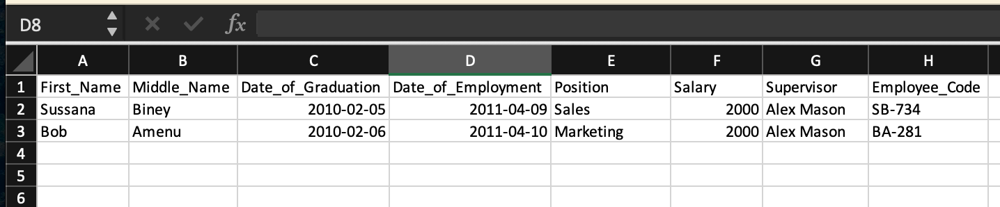

## Available Scripts

In the project directory, you can run:

### `npm start`

Runs the app in the development mode.\
Open [http://localhost:3000](http://localhost:3000) to view it in your browser.

### `npm run build`

Builds the app for production to the `build` folder.\
It correctly bundles React in production mode and optimizes the build for the best performance.

The build is minified and the filenames include the hashes.\
Your app is ready to be deployed!

### `Structure of CSV file for upload`

In the supervisors column to add more that one supervisor a ";" must be used as a separator. A sample excel file is also included to help out. Date format is also YYYY/MM/DD. filename: employees.xlsx, it must first be converted in to a .csv file before uploading.

### `Accessing the application`

Username: admin
Password: keypass
